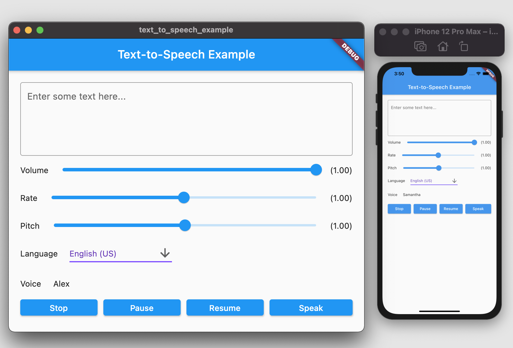

# Text To Speech

A Flutter plugin provides TTS (Text-To-Speech) Service. This plugin aims to offer the most from iOS, Android, web, and macOS.



## Getting Started

To use this plugin, add `text_to_speech` as a dependency in your pubspec.yaml file:

```yaml
dependencies:
  text_to_speech: ^0.1.0
```

## Installation

### Android

- Minimum SDK version:  `21`
- Applications targeting SDK 30 (Android 11) need to declare  `TextToSpeech.Engine.INTENT_ACTION_TTS_SERVICE` in the `queries` elements of Android Manifest (See [Android documentation](https://developer.android.com/reference/android/speech/tts/TextToSpeech)).

```
<queries>
  <intent>
      <action android:name="android.intent.action.TTS_SERVICE" />
  </intent>
 </queries>
```

### iOS & macOS

- iOS minimum version: `7.0`
- macOs minimum version `10.14`

(See [Apple documentation](https://developer.apple.com/documentation/avfaudio/avspeechsynthesizer)).

## Features

| Feature      | Android            | iOS                | web                | macOS              |
| ------------ | ------------------ | ------------------ | ------------------ | ------------------ |
| speak        | :white_check_mark: | :white_check_mark: | :white_check_mark: | :white_check_mark: |
| stop         | :white_check_mark: | :white_check_mark: | :white_check_mark: | :white_check_mark: |
| pause        | -                  | :white_check_mark: | :white_check_mark: | :white_check_mark: |
| resume       | -                  | :white_check_mark: | :white_check_mark: | :white_check_mark: |
| set volume   | :white_check_mark: | :white_check_mark: | :white_check_mark: | :white_check_mark: |
| set rate     | :white_check_mark: | :white_check_mark: | :white_check_mark: | :white_check_mark: |
| set pitch    | :white_check_mark: | :white_check_mark: | :white_check_mark: | :white_check_mark: |
| set language | :white_check_mark: | :white_check_mark: | :white_check_mark: | :white_check_mark: |
| get language | :white_check_mark: | :white_check_mark: | :white_check_mark: | :white_check_mark: |
| get voice    | :white_check_mark: | :white_check_mark: | :white_check_mark: | :white_check_mark: |


## Usages

To start, import the dependency in your code:

```
import 'package:text_to_speech/text_to_speech.dart';
```

Then, create instance of TextToSpeech class:

```
TextToSpeech tts = TextToSpeech();
```

**Speak**

```
String text = "Hello, Good Morning!";
tts.speak(text);
```

**Set Volume**
Volume range: `0-1`. Default value: `1` (maximum)

```
double volume = 1.0;
tts.setVolume(volume);
```

**Set Rate**
Volume range: `0-2`. Default value: `1` (standard). Give 2 will make voice 2x faster. Give 0.5 will make voice half slower.

```
double rate = 1.0;
tts.setRate(rate);
```

**Set Pitch**
Pitch range: `0-2`. Default value: `1`

```
double pitch = 1.0;
tts.setPitch(pitch);
```

**Set Language**
Accepting locale tag name of specific language, e.g. 'en-US'. You can retrieve list of supported language using `getLanguage` function.

```
String language = 'en-US';
tts.setLanguage(language);
```

**Get Languages**
Provide list of supported language codes in locale tag name format, e.g. 'en-US'. You can get display name for specific language code

```
String language = 'en-US';
tts.setLanguage(language);
```

**Get Voice**
We can get all available voices or get voices of specific language. This function will returns particular voice name.

```
List<String> voices = await tts.getVoices();

String language = 'en-US';
List<String> voices = await tts.getVoiceByLang(language);
```


## Native API Reference

- Android TTS API: https://developer.android.com/reference/android/speech/tts/TextToSpeech
- iOS/macOS AVSpeechSynthesizer API: https://developer.apple.com/documentation/avfaudio/avspeechsynthesizer
- Web Speech API: (**https://dvcs.w3.org/hg/speech-api/raw-file/tip/speechapi.html#tts-section**)

## Example

You can find example in the [example](https://github.com/ixsans/text_to_speech/tree/main/example) folder and run it to check the implementation.
Move to example directory:

```
$ cd example
```

Run Android / iOS

```
$ flutter run -d <device_name>
```

Run Web

```
$ flutter run -d chrome
```

Run macOS

```
$ flutter run -d macOS
```